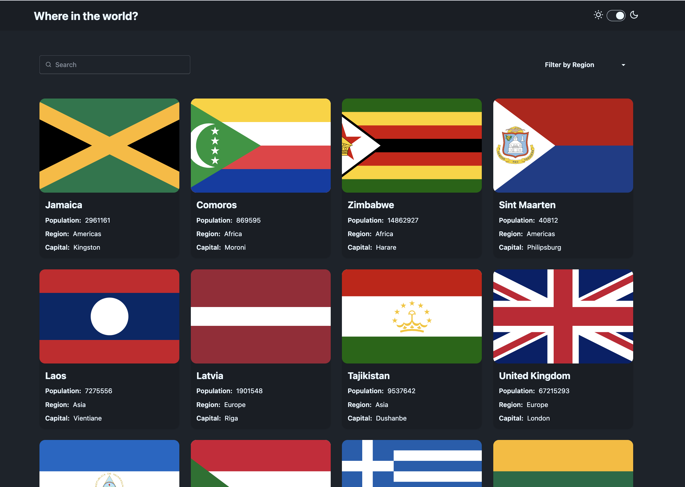
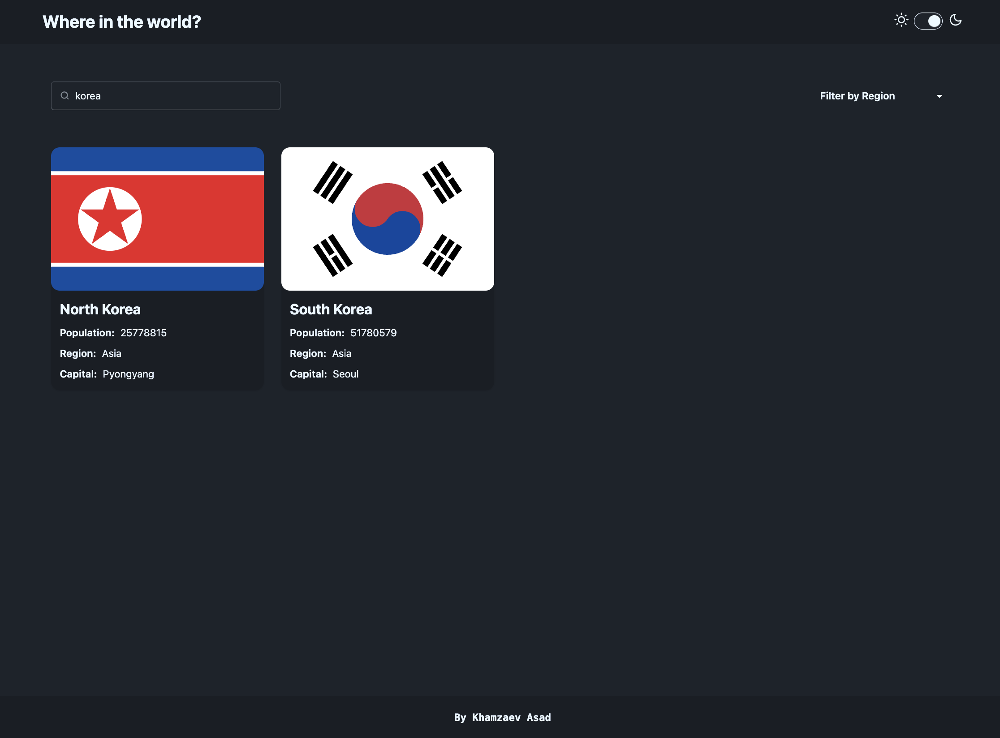
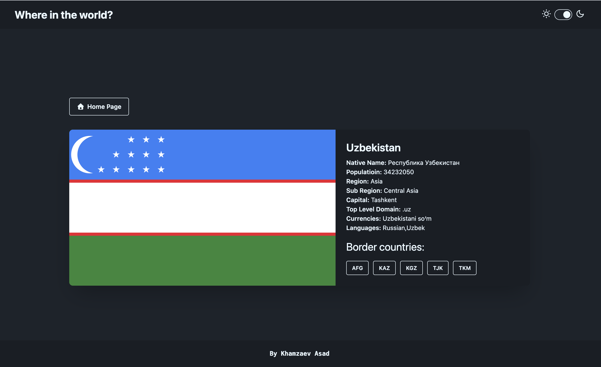
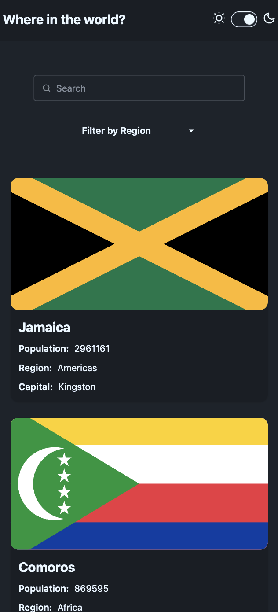
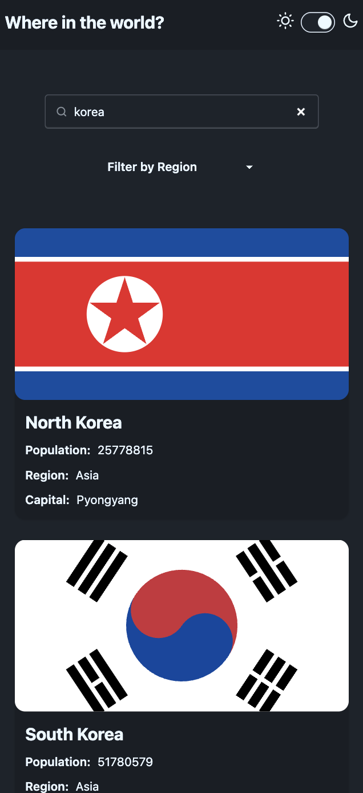
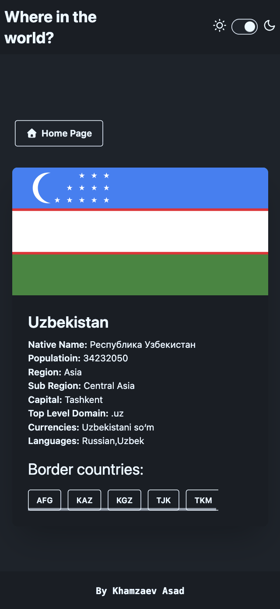

# 🌍 Countries Web App - World Explorer Platform


## 📱 Preview

<div align="center">

### Desktop View





### Mobile View





</div>

## 📖 About The Project

**Countries Web App** is a modern, responsive web application that allows users to explore information about all countries around the world. Built with cutting-edge web technologies and powered by the REST Countries API, it provides users with an intuitive interface to discover, search, and learn about different countries and their details.

### ✨ Key Features

- 🌐 **Comprehensive Country Data** - Complete information from REST Countries API
- 🔍 **Real-time Search** - Instant search functionality across all countries
- 🏷️ **Region Filtering** - Filter countries by geographic regions
- 🌙 **Dark/Light Mode** - Toggle between dark and light themes
- 📱 **Fully Responsive** - Optimized for desktop, tablet, and mobile devices
- 🎨 **Modern UI/UX** - Clean design with smooth animations and transitions
- 🌟 **Interactive Cards** - Beautiful country cards with flag displays
- 📋 **Detailed Views** - Comprehensive country information pages
- ⚡ **Fast Performance** - Optimized build with Vite for lightning-fast loading
- 🔄 **Dynamic Loading** - Efficient data fetching and rendering

## 🖥️ Live Demo

### 🏠 Homepage

- **Hero Section**: Welcome banner with country exploration theme
- **Search Bar**: Real-time search through all countries
- **Filter Options**: Region-based filtering system
- **Countries Grid**: Responsive layout showcasing country cards

### 🌍 Country Cards

- **Flag Display**: High-quality country flag images
- **Essential Info**: Population, region, and capital information
- **Interactive Design**: Hover effects and smooth transitions
- **Responsive Grid**: Adapts from 1 column (mobile) to 4 columns (desktop)

### 📄 Country Details

- **Comprehensive Data**: Full country information including languages, currencies
- **Related Information**: Border countries and additional details
- **Navigation**: Easy back navigation and country switching
- **Responsive Layout**: Optimized for all screen sizes

## 🛠️ Built With

### Core Technologies

- **[Vite](https://vitejs.dev/)** - Next generation frontend tooling
- **[JavaScript ES6+](https://developer.mozilla.org/en-US/docs/Web/JavaScript)** - Modern JavaScript features
- **[HTML5](https://developer.mozilla.org/en-US/docs/Web/HTML)** - Semantic markup

### Styling & UI

- **[Tailwind CSS](https://tailwindcss.com/)** - Utility-first CSS framework
- **[DaisyUI](https://daisyui.com/)** - Tailwind CSS components library
- **Custom CSS** - Additional styling for unique components

### API & Data

- **[REST Countries API](https://restcountries.com/v3.1/all?fields=name,capital,region,population,flags)** - Real country data
- **Fetch API** - Modern data fetching
- **JSON Processing** - Efficient data handling

### Tools & Libraries

- **Theme Switching** - Dark/Light mode implementation
- **Local Storage** - Theme preference persistence
- **ES6 Modules** - Modular JavaScript architecture
- **Responsive Images** - Optimized flag loading

## 🚀 Getting Started

### Prerequisites

Make sure you have the following installed:

- **Node.js** (version 16.0 or higher)
- **npm** or **yarn** package manager
- **Git** for version control

### Installation

1. **Clone the repository**

   ```bash
   git clone https://github.com/khamzaevasad/countries-web-app.git
   ```

2. **Navigate to the project directory**

   ```bash
   cd countries-web-app
   ```

3. **Install dependencies**

   ```bash
   npm install
   # or
   yarn install
   ```

4. **Start the development server**

   ```bash
   npm run dev
   # or
   yarn dev
   ```

5. **Open your browser**
   ```
   http://localhost:5173
   ```

### Build for Production

```bash
npm run build
# or
yarn build
```

### Preview Production Build

```bash
npm run preview
# or
yarn preview
```

## 📂 Project Structure

```
countries-web-app/
├── public/
│   ├── logo.svg
│   ├── vite.svg
│   └── favicon.ico
├── src/
│   ├── js/
│   │   ├── action.js
│   │   ├── detail.js
│   │   ├── loader.js
│   │   ├── mode.js
│   │   ├── request.js
│   │   ├── textAnimation.js
│   │   └── updateUI.js
│   ├── pages/
│   │   └── [country pages]
│   ├── main.js
│   └── style.css
├── index.html
├── package.json
├── vite.config.js
├── tailwind.config.js
├── package-lock.json
└── README.md
```

## 🎯 Features Overview

### 🌐 Country Data

- **Complete Information**: Name, capital, region, population, and flags
- **Real-time Updates**: Fresh data from REST Countries API
- **Flag Display**: High-quality country flag images
- **Detailed Views**: Comprehensive country profiles

### 🔍 Search & Filter

- **Real-time Search**: Instant results as you type
- **Region Filtering**: Filter by Africa, Americas, Asia, Europe, Oceania
- **Smart Results**: Efficient search across country names
- **No Results Handling**: Elegant empty state display

### 🌙 Theme System

- **Dark/Light Mode**: Toggle between themes
- **Persistent Settings**: Theme preference saved locally
- **Smooth Transitions**: Animated theme switching
- **System Integration**: Respects user's system preferences

### 📱 Responsive Design

- **Mobile-First**: Optimized for mobile devices
- **Tablet Support**: Perfect medium screen experience
- **Desktop Enhanced**: Full-featured desktop interface
- **Cross-Browser**: Compatible with all modern browsers

### ⚡ Performance Features

- **Lazy Loading**: Images load as needed
- **Efficient Filtering**: Optimized search algorithms
- **Fast Refresh**: Hot module replacement during development
- **Minified Assets**: Compressed CSS and JavaScript

## 🎨 Design System

### Color Palette

- **Primary**: World map inspired blues and greens
- **Secondary**: Flag-inspired accent colors
- **Dark Mode**: Deep backgrounds with light text
- **Light Mode**: Clean whites with dark text

### Typography

- **Headers**: Bold, modern sans-serif fonts
- **Body Text**: Clean, readable typography
- **Responsive Scaling**: Fluid typography across devices

### Components

- **Country Cards**: Consistent flag and info display
- **Search Bar**: Prominent search functionality
- **Filter Buttons**: Clear region selection
- **Theme Toggle**: Intuitive dark/light mode switch

## 🔧 Configuration

### Tailwind CSS

Custom configuration in `tailwind.config.js` includes:

- Extended color palette for themes
- Custom spacing scales
- Responsive breakpoints
- Animation utilities
- DaisyUI theme integration

### Vite

Optimized build configuration with:

- Fast HMR (Hot Module Replacement)
- CSS preprocessing
- Asset optimization
- Development server settings

## 📱 Responsive Breakpoints

```css
/* Mobile */
@media (max-width: 640px) {
  /* sm */
}

/* Tablet */
@media (min-width: 641px) and (max-width: 1024px) {
  /* md-lg */
}

/* Desktop */
@media (min-width: 1025px) {
  /* xl+ */
}
```

## 🌐 API Integration

The application integrates with the REST Countries API:

**Endpoint**: `https://restcountries.com/v3.1/all?fields=name,capital,region,population,flags`

**Data Fields**:

- **name**: Country names (common and official)
- **capital**: Capital city information
- **region**: Geographic region classification
- **population**: Current population data
- **flags**: Country flag images (PNG/SVG)

### API Features

- **Real-time Data**: Live country information
- **Comprehensive Coverage**: All UN recognized countries
- **Flag Images**: High-quality flag representations
- **Structured Data**: Clean, consistent JSON format

## 🎮 User Interactions

### Search Functionality

- Type to search across all country names
- Instant results with debounced input
- Case-insensitive matching
- Clear search option

### Filtering System

- **All Regions**: Show all countries
- **Africa**: African countries only
- **Americas**: North and South American countries
- **Asia**: Asian countries only
- **Europe**: European countries only
- **Oceania**: Oceanian countries only

### Theme Controls

- Toggle button in navigation
- Persistent theme storage
- Smooth transition animations
- System preference detection

## 🤝 Contributing

Contributions are what make the open source community such an amazing place to learn, inspire, and create. Any contributions you make are **greatly appreciated**.

1. **Fork the Project**
2. **Create your Feature Branch** (`git checkout -b feature/AmazingFeature`)
3. **Commit your Changes** (`git commit -m 'Add some AmazingFeature'`)
4. **Push to the Branch** (`git push origin feature/AmazingFeature`)
5. **Open a Pull Request**

### Development Guidelines

- Follow ES6+ JavaScript standards
- Use Tailwind CSS for styling
- Maintain responsive design principles
- Write clean, commented code
- Test across different devices and browsers
- Ensure accessibility compliance

## 📄 License

This project is licensed under the MIT License - see the [LICENSE](LICENSE) file for details.

## 👨‍💻 Author

**Khamzaev Asad**

- GitHub: [@khamzaevasad](https://github.com/khamzaevasad)
- Email: xamzayevasad442@gmail.com

## 🙏 Acknowledgments

- **[REST Countries API](https://restcountries.com/)** - Comprehensive country data
- **[Tailwind CSS Team](https://tailwindcss.com/)** - Amazing utility-first framework
- **[DaisyUI](https://daisyui.com/)** - Beautiful component library
- **[Vite Team](https://vitejs.dev/)** - Lightning-fast build tool
- **World Geography** - Inspiration for exploring our diverse world

## 📊 Statistics

- **Countries Covered**: 250+ countries and territories
- **Data Points**: 5 key fields per country
- **Performance**: Sub-second search results
- **Compatibility**: 95%+ browser support
- **Mobile Optimized**: 100% responsive design

## 📞 Support

<div align="center">
  <p>Made with ❤️ for world explorers and geography enthusiasts</p>
  <p>© 2025 Countries Web App. All rights reserved.</p>
</div>

---

<div align="center">
  <p><strong>Explore the World, One Country at a Time 🌍</strong></p>
</div>
